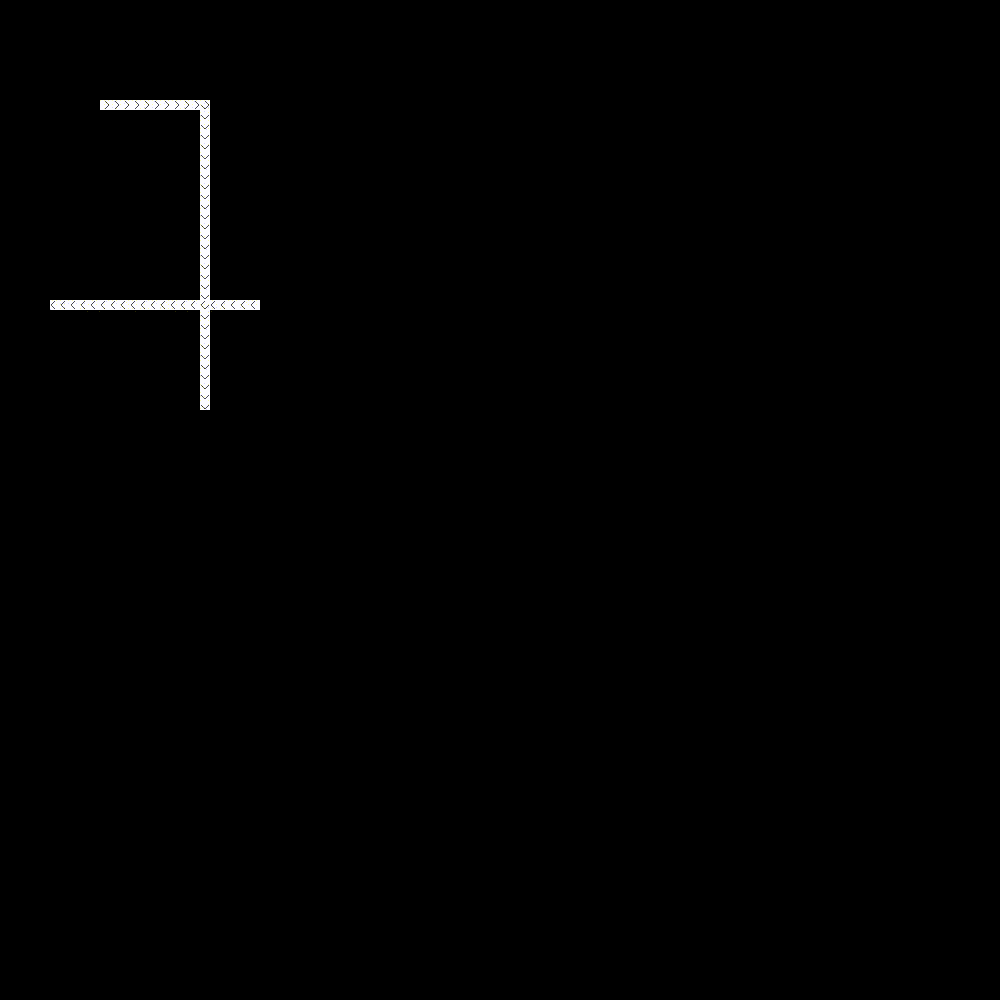

# FLOWAMOK

A traffic simulation for the ages.  Maybe a game at some point.

It's a stencil and then some.  Work in progress!

Requires [Futhark](http://futhark-lang.org) and SDL2 and SDL2-ttf
libraries with associated header files.


## Building and running

First run `futhark pkg sync` once.

Then run `make run` to build and run in a window.


## Controls

- Space: Step through the simulation manually.
- Left arrow key: Move left in the list of scenarios.
- Right arrow key: Move left in the list of scenarios.
- `a`: Toggle auto-stepping.
- Up arrow key: Increment the steps per second in the auto-stepping mode.
- Down arrow key: Decrement the steps per second in the auto-stepping mode.
- `r`: Reset the current grid and stop auto-stepping.
- '1': Zoom in.
- '2': Zoom out.
- F1: Toggle text in upper-left corner.

## What it looks like

```futhark
import "animation"
module scenarios = import "scenarios"
module anim = mk_anim scenarios.overlapping_tight_cycles
let init = anim.init
let step = anim.step
```

```
> :anim (step, init 30i64 30i64 10i64 123i32, 400i64)
```




