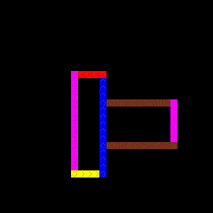

# FLOWAMOK

A traffic simulation for the ages.  Maybe a game at some point.

It's a stencil and then some.  Work in progress!

## What it looks like

```futhark
import "animation"
module scenarios = import "explorer/scenarios"
module anim = mk_anim scenarios.overlapping_tight_cycles
def init = anim.init
def step = anim.step
```

```
> :video (step, init 30i64 30i64 10i64 123i32, 400i64)
```





## Basic building

Requires [Futhark](http://futhark-lang.org) and SDL2 and SDL2-ttf
libraries with associated header files.

First run `futhark pkg sync` once.  Then choose which interface you want to
build (currently only one).

You can configure backends and frontends as described in
<https://github.com/diku-dk/lys#configuring-the-backend>.  You can also
put these custom `LYS_*` variables in a file `custom.mk`, which will
then be read by the Makefile.


## Road Designer

Design your own road network as the simulation is running.

Run `make designer/designer && designer/designer` to build and run in a window.

### Controls

- F1: Toggle text in upper-left corner.
- Space: Pause/unpause the simulation.
- `r`: Reset the simulation.
- Left-click mouse and move cursor around to build roads.


## Scenario explorer

Explore different hand-crafted scenarios.

Run `make explorer/explorer && explorer/explorer` to build and run in a window.

### Controls

- F1: Toggle text in upper-left corner.
- Space: Step through the simulation manually.
- Left arrow key: Move left in the list of scenarios.
- Right arrow key: Move left in the list of scenarios.
- `a`: Toggle auto-stepping.
- `p`: Toggle whether to support cycles and similar perfect but slow simulation.
- Up arrow key: Increment the steps per second in the auto-stepping mode.
- Down arrow key: Decrement the steps per second in the auto-stepping mode.
- `r`: Reset the current grid and stop auto-stepping.
- `1`: Zoom in.
- `2`: Zoom out.
